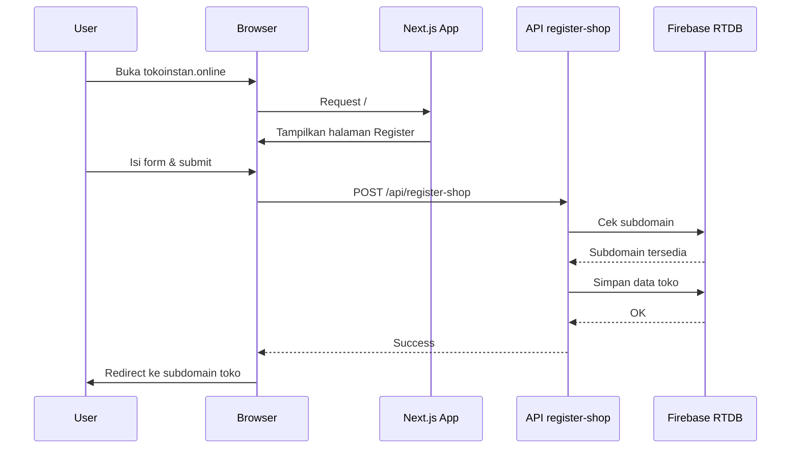

# Github - Next.js + vercel + Firebase + Dynamic Subdomain

## 🚀 Features
- Dynamic shop pages via /[shop]
- Firebase Realtime Database
- Wildcard subdomain compatible for Vercel
- Google Sheet CSV product source

## 📦 Install
```
npm install
```

## ▶ Run
```
npm run dev
```

## 📊 Alur Register Toko (domain utama)



## 📊 Alur Akses Toko (Subdomain)
```mermaid
sequenceDiagram
    participant User
    participant Browser
    participant Middleware
    participant Page as ShopPage
    participant API as API get-shop
    participant Firebase as Firebase RTDB
    participant Sheet as Google Sheet

    User ->> Browser: Buka tokoku.tokoinstan.online
    Browser ->> Middleware: Request
    Middleware ->> Browser: Set header x-shop-id

    Browser ->> Page: Render halaman toko
    Page ->> API: GET /api/get-shop?shop=tokoku
    API ->> Firebase: Ambil data toko
    Firebase -->> API: Data toko

    API -->> Page: JSON toko
    Page ->> Sheet: Fetch CSV produk
    Sheet -->> Page: Data CSV

    Page ->> Browser: Tampilkan toko & produk

